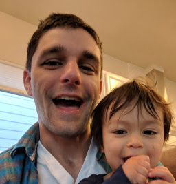

% Thomas Nelson's Homepage

## Who am I?

I teach computer science instructor at the University of Colorado. I\'m
interested in numerical computation, languages and compilers, and
computer science pedagogy.

<aside>

</aside>
## Courses I teach

I'm currently teaching for the post-baccalaurate program.  I teach:

- [CSCI 2270: Data Structures](https://catalog.colorado.edu/search/?search=CSCI+2270)
- [CSCI 2400: Computer Systems](https://catalog.colorado.edu/search/?search=CSCI+2400)
- [CSCI 3308: Software Development Tools and  Methods](https://catalog.colorado.edu/search/?search=CSCI+3308)
- [CSCI 3155: Principles and Practice of Programming Languages](https://catalog.colorado.edu/search/?search=CSCI+3155)

## Education

-   **2010\--2015** Ph.D. Computer Science, University of Colorado
-   **2008\--2010** M.S. Computer Science, University of Colorado
-   **2004\--2007** B.S. Computer Science, University of Texas at Austin

## Ph.D. Thesis

**DSLs and Search for Linear Algebra Performance**\
\
Advisor: Elizabeth Jessup\
I designed search algorithms and ran performance testing for two
domain-specific languages, in the domains of matrix and tensor algebra.
These languages allow the user to specify high-level mathematical
kernels, and the search algorithms automatically test many code
transformations and optimizations, searching for best performance on
CPUs and GPUs.

## Master\'s Thesis

**Genetic Algorithms with Chaotic Population Dynamics**\
\
Advisor: Elizabeth Bradley\
I created a genetic algorithm with a population that could grow and
shrink periodically or chaotically. I then evaluated the algorithm\'s
performance under fixed, periodic, and chaotic populations in solving
optimization problems.

## Work Experience

-   **2016-2018:** Instructor, University of Colorado
-   **2010-2015:** Research Assistant, Argonne National Labs
-   **2008:** Software Developer, Alliance Tech, Austin, Texas

## Publications

-   Thomas Nelson, Axel Rivera, Mary Hall, Paul Hovland, Elizabeth
    Jessup, Boyana Norris, Prasanna Balaprakash. **Generating Efficient
    Tensor Contractions for GPUs** International Conference on Parallel
    Processing, 2015.
-   Thomas Nelson, Geoffrey Belter, Jeremy Siek, Elizabeth Jessup,
    Boyana Norris. **Reliable Generation of High-Performance Matrix
    Algebra.** ACM Transactions on Mathematical Software, 41(3), 2015.

## Posters and Talks

Thomas Nelson, Geoffrey Belter, Jeremy Siek, Boyana Norris, Elizabeth
Jessup. **Search Strategies for Empirical Autotuning in Linear
Algebra.** Presentation, SIAM CSE 2013.

Xing Jie Zhong, Thomas Nelson, Elizabeth Jessup, Jeremy Siek.
**Population Size Effects in Genetic Algorithms for Auto Tuning**
Technical Poster, SIAM CSE 2013.

Christopher Gropp, Geoffrey Belter, Elizabeth Jessup, Thomas Nelson,
Boyana Norris, Jeremy Siek. **Build-to-Order Linear Algebra Kernels**
Technical Poster, Supercomputing, 2012.

Geoff Belter, Elizabeth Jessup, Ian Karlin, Thomas Nelson, Boyana
Norris, Jeremy Siek. **Exploring the optimization space for build to
order matrix algebra** Technical Report ANL/MCS-P1890-0511, Argonne
National Laboratory, May 2011.

## Contact Me
- Email: <thomasharrisonnelson@gmail.com>
- Github: <https://github.com/nelsonth>
- Stack overflow: <https://stackoverflow.com/users/1717607/thomas-nelson>

